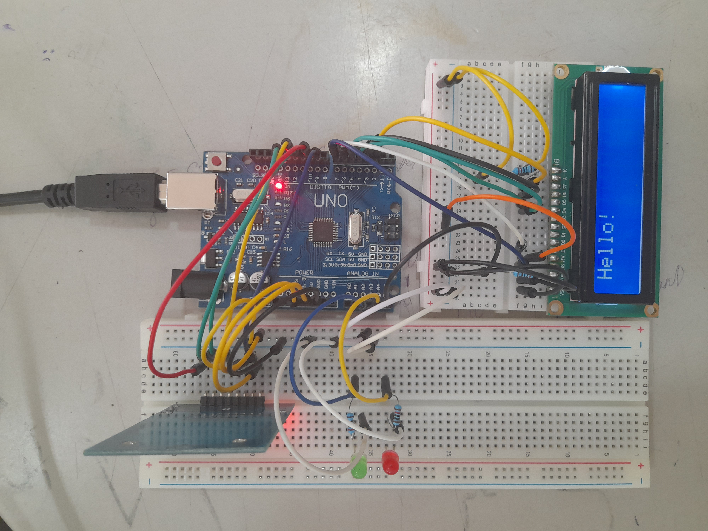

# **RFID READER**

### Introduction
- RFID stands for radio-frequency identification.
- A RFID system consists of a tag and a reader.
- When the tag is brought close to the reader, the tag transmits a specific ID.
- The transmitted ID is then read by the reader for identification.

    

### Objective
- To create an identification system using RFID.
- To display identification result on a LCD.
- To show identification status using LEDs.

### Hardware / Required components
1. Arduino UNO
2. Mifare-RC522
3. 16,2 LCD
4. Red and green LEDs
5. Connecting wires
6. Bread boards
7. Resistors

### Software
1. Arduino IDE
2. MFRC255 library

### Circuit diagram


### Code

*rfid.cpp*
```
#pragma once

#include <MFRC522.h>

const int RFID_MAX = 10;


class Member {
public:
  String name;
  String rfid;

  Member(String name, String rfid)
  : name(name), rfid(rfid) {}
};


class RFID {
private:
  int length;
  byte uid[RFID_MAX];

public:
  RFID() {
    length = 4;
    for (int i = 0; i < RFID_MAX; ++i)
      uid[i] = 0;
  }

  RFID(MFRC522::Uid uid) {
    setUID(uid);
  }

  void setUID(MFRC522::Uid uid) {
    length = uid.size;
    for (int i = 0; i < length; ++i)
      this->uid[i] = uid.uidByte[i];
  }

  String toString() {
    String s;
    if (length <= 0) return s;                    // empty string if no length
    if (uid[0] < 0x10) s += '0';                  // first byte
    s += String(uid[0], 16);
    for (int i = 1; i < length; ++i) {            // subsequent bytes prepended with space
      s += '-';
      if (uid[i] < 0x10) s += '0';
      s += String(uid[i], 16);
    }
    s.toUpperCase();
    return s;
  }

  bool operator==(const RFID rfid) {
    if (length != rfid.length)
      return false;
    for (int i = 0; i < length; ++i)
      if (uid[i] != rfid.uid[i])
        return false;
    return true;
  }

  bool operator==(const String rfid) {
    return rfid == toString();
  }
};
```

*rfid_rc522.ino*
```
#include <SPI.h>
#include <MFRC522.h>
#include <LiquidCrystal.h>

#include "rfid.cpp"

const int V0 = A5;
const int RS = 7;
const int EN = 6;
const int D4 = 5;
const int D5 = 4;
const int D6 = 3;
const int D7 = 2;

const int MFRC_RST = 9;
const int MFRC_SDA = 10;

/*
For SPI communication with MFRC522
  MOSI -> 11
  MISO -> 12
  SCK  -> 13
*/

const int RED = A3;
const int BLUE = A2;

MFRC522 mfrc = MFRC522(MFRC_SDA, MFRC_RST);
LiquidCrystal LCD = LiquidCrystal(RS, EN, D4, D5, D6, D7);

RFID rfid = RFID();

const Member authorized[] = {
  // Member("Bijon", "13-B3-87-80"),
  Member("Niloy", "65-A1-FC-AA")
};

const int lenAuthorized = sizeof(authorized) / sizeof(Member);


void serialLog(String message)
{
  if (!Serial.available()) return;
  Serial.println(message);
}


void setup() {
  Serial.begin(9600);
  SPI.begin();
  mfrc.PCD_Init();
  pinMode(V0, OUTPUT);
  pinMode(RED, OUTPUT);
  pinMode(BLUE, OUTPUT);
  serialLog("\n------ New Session -----\n");
  serialLog("Initialized RFID: " + rfid.toString() + '\n');
  analogWrite(V0, 100);
  LCD.begin(16, 2);
  LCD.print("Hello!");
}


void loop() {
  // no card
  if (!mfrc.PICC_IsNewCardPresent() || !mfrc.PICC_ReadCardSerial()) {
    delay(500);
    return;
  }
  // same card
  LCD.clear();
  // if (rfid == RFID(mfrc.uid)) {
  //   LCD.print("Already scanned.");
  //   serialLog("Already scanned.");
  //   delay(500);
  //   return;
  // }
  // new card
  rfid.setUID(mfrc.uid);
  serialLog("Scanned RFID: " + rfid.toString());
  for (int i = 0; i < lenAuthorized; ++i) {
    if (rfid == authorized[i].rfid) {
      digitalWrite(BLUE, HIGH);
      LCD.print("Authorized.");
      LCD.setCursor(0, 1);
      LCD.print("Member " + authorized[i].name + ".");
      serialLog("Authorized.");
      delay(500);
      digitalWrite(BLUE, LOW);
      return;
    }
  }
  // not authorized
  digitalWrite(RED, HIGH);
  LCD.print("Not authorized.");
  serialLog("Not authorized.");
  delay(500);
  digitalWrite(RED, LOW);
}
```

### Conclusion
- RFID can be integrated with a microcontroller to handle identification.

### Project
<p>
  <h4>Setup</h4>
  
</p>
<p>
  <h4>Authorized</h4>
  
</p>
<p>
  <h4>Not authorized</h4>
  
</p>

## Acknowledgement

### Reference
1. https://en.wikipedia.org/wiki/Radio-frequency_identification
2. https://www.amazon.in/SunFounder-Mifare-Reader-Arduino-Raspberry/dp/B07KGBJ9VG
3. https://docs.arduino.cc/resources/pinouts/A000066-full-pinout.pdf
4. Arduino and MFRC522 built-in examples
